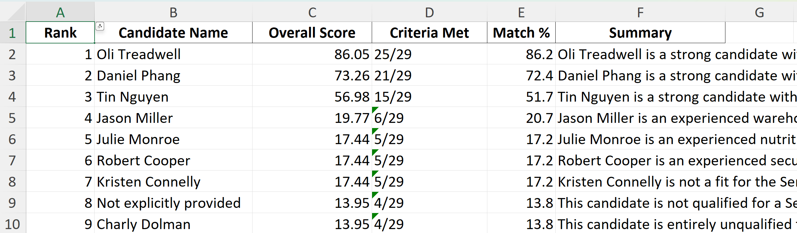

# ResumeReview

An AI-powered resume evaluation system built with Claude Code that automates candidate screening by parsing resumes and scoring them against job descriptions. This tool helps hiring teams quickly identify top candidates using structured, criteria-based evaluation.

## Overview

ResumeReview combines two powerful Claude Code skills to streamline the hiring process:

1. **Resume Parser** - Converts resumes from various formats (PDF, DOCX, TXT) into clean markdown
2. **Resume Scorer** - Analyzes and ranks candidates against job requirements using LLM-powered evaluation

```
                         ResumeReview Workflow
                         =====================

 ◇──────────────◇                          ◇──────────────◇
 │ PDF/DOCX/TXT │                           │     Job      │
 │    Files     │                           │ Description  │
 ◇──────────────◇                          ◇──────────────◇
       │                                            │
       │                                            │
       ▼                                            │
┌─────────────────────┐                             │
│                     │                             │
│  RESUME PARSER      │                             │
│                     │                             │
│  Input:  Resumes    │                             │
│  Output: Markdown   │                             │
│                     │                             │
└─────────┬───────────┘                             │
          │                                         │
          │                                         │
          │  ◇──────────────◇                      │
          └─▶│   Parsed     │                      │
             │  Resumes.md  │                       │
             ◇──────────────◇                      │
                    │                               │
                    └───────────┬───────────────────┘
                                │
                                ▼
                       ┌─────────────────────┐
                       │                     │
                       │  RESUME SCORER      │
                       │                     │
                       │  Input:  Resumes    │
                       │          Job Desc   │
                       │  Output: Reports    │
                       │                     │
                       └─────────┬───────────┘
                                 │
                 ┌───────────────┼───────────────┐
                 │               │               │
                 ▼               ▼               ▼
        ◇──────────────◇  ◇──────────────◇  ◇──────────────◇
        │   Criteria   │   │  Evaluation  │   │    Score     │
        │  (JSON + MD) │   │    Report    │   │    Report    │
        │              │   │  (Excel/MD)  │   │    (JSON)    │
        ◇──────────────◇  ◇──────────────◇  ◇──────────────◇
```

## Table of Contents

- [Quick Start](#quick-start)
- [Skills](#skills)
  - [Resume Parser](#resume-parser-skill)
  - [Resume Scorer](#resume-scorer-skill)
- [Understanding the Output](#understanding-the-output)
  - [Excel Report Structure](#excel-report-structure)
  - [Markdown Report](#markdown-report)
  - [JSON Output](#json-output)
- [Prerequisites](#prerequisites)
- [Complete Workflow Example](#complete-workflow-example)
- [Tips for Best Results](#tips-for-best-results)

---

## Quick Start

```bash
# Step 1: Parse resumes (if you have PDF/DOCX files)
python .claude/skills/resume-parser/scripts/parse_pdf.py resume.pdf parsed_resumes/resume.md

# Step 2: Score candidates against job description
python .claude/skills/resume-scorer/scripts/analyze_resumes.py \
  --resumes-dir ./parsed_resumes \
  --job-desc ./job_description.txt \
  --output-dir ./resume_scores
```

---

## Skills

### Resume Parser Skill

Converts resume files from various formats into clean, structured markdown while preserving formatting and layout.

#### Supported Formats

- **PDF** - Advanced layout detection with two-column support
- **DOCX** - Preserves heading styles, bold/italic formatting, and lists
- **TXT** - Detects headers, bullet points, and contact information

#### Key Features

**PDF Parsing:**
- Two-column layout detection and proper text extraction
- Advanced header recognition using multiple heuristics
- Bullet point preservation with extended character support
- Multi-page content handling

**DOCX Parsing:**
- Maintains heading hierarchy
- Preserves inline formatting (bold, italic)
- Converts list items to markdown format

**TXT Parsing:**
- Detects section headers (all caps, title case)
- Identifies contact information (email, phone, URLs)
- Adds markdown structure to plain text

#### Usage

```bash
# Parse a PDF resume
python .claude/skills/resume-parser/scripts/parse_pdf.py input.pdf output.md

# Parse a DOCX resume
python .claude/skills/resume-parser/scripts/parse_docx.py input.docx output.md

# Parse a TXT resume
python .claude/skills/resume-parser/scripts/parse_txt.py input.txt output.md
```

#### Requirements

```bash
pip install pdfplumber        # For PDF parsing
pip install python-docx       # For DOCX parsing
# TXT parsing uses standard library only
```

#### Output Format

All resumes are converted to markdown with:
- Section headers (`##`)
- Maintained bullet points and lists
- Inline formatting where detected
- Clean, readable structure

---

### Resume Scorer Skill

Systematically analyzes and ranks resume candidates against job requirements using Claude's AI capabilities with structured evaluation criteria.

#### What It Does

1. **Extracts Evaluation Criteria** - Claude analyzes the job description and structures all requirements into weighted categories
2. **Scores Each Resume** - Binary scoring (0 or 1) for each criterion with detailed reasoning and resume citations
3. **Generates Reports** - Creates comprehensive Excel workbooks and markdown reports with rankings and analysis
4. **Provides Actionable Insights** - Category breakdowns, strengths/gaps, and filterable candidate data

#### Key Features

- **LLM-Powered Criteria Extraction** - Automatically identifies and categorizes all job requirements
- **Weighted Scoring System** - Critical/High/Medium/Low weights for meaningful overall scores
- **Citation-Backed Evaluation** - Every score includes specific evidence from the resume
- **Multi-Sheet Excel Reports** - Comprehensive workbooks for easy candidate comparison
- **Markdown Reports** - Human-readable detailed analysis

#### Prerequisites

```bash
# Install required packages
pip install anthropic pandas openpyxl

# Set up Anthropic API key (choose one method):

# Method 1: .env file (recommended)
echo "ANTHROPIC_API_KEY=your-api-key-here" > .env

# Method 2: Environment variable
export ANTHROPIC_API_KEY='your-api-key-here'  # Linux/Mac
$env:ANTHROPIC_API_KEY='your-api-key-here'     # Windows PowerShell
```

#### Usage

```bash
# Basic analysis
python .claude/skills/resume-scorer/scripts/analyze_resumes.py \
  --resumes-dir ./parsed_resumes \
  --job-desc ./job_description.txt

# With custom output directory
python .claude/skills/resume-scorer/scripts/analyze_resumes.py \
  --resumes-dir ./parsed_resumes \
  --job-desc ./job_description.txt \
  --output-dir ./hiring_round_1
```

#### Scoring Methodology

**Overall Score Calculation:**
```
Overall Score = (Σ(criterion_score × weight) / Σ(weight)) × 100
```

**Weight Values:**
- **Critical**: 4.0
- **High**: 3.0
- **Medium**: 2.0
- **Low**: 1.0

**Binary Scoring:**
- **1 (Met)**: Clear evidence in resume that criterion is satisfied
- **0 (Not Met)**: No evidence or insufficient evidence

---

## Understanding the Output

The Resume Scorer generates three types of output files in the `resume_scores` folder:

### Output Structure

```
resume_scores/
├── criteria/
│   ├── evaluation_criteria.json    # Structured criteria data
│   └── evaluation_criteria.md      # Human-readable criteria reference
├── resume_evaluation_[timestamp].xlsx   # Multi-sheet Excel workbook
├── resume_evaluation_[timestamp].md     # Detailed markdown report
└── resume_evaluation_[timestamp].json   # Raw evaluation data
```

---

### Excel Report Structure

The Excel workbook (`resume_evaluation_[timestamp].xlsx`) contains five interconnected sheets designed for different analysis perspectives.

#### Sheet 1: Rankings

**Purpose:** Quick identification of top candidates

**Columns:**
- **Rank** - Ordered position based on overall score
- **Candidate Name** - Name extracted from resume
- **Overall Score** - Weighted score out of 100
- **Criteria Met** - Count of criteria met (e.g., "28/32")
- **Match Percentage** - Percentage of criteria met
- **Executive Summary** - One-paragraph overview of candidate strengths and gaps

**Use Cases:**
- Quick review of top candidates
- Sorting by overall score or match percentage
- Getting high-level summaries of each candidate



---

#### Sheet 2: Category Scores

**Purpose:** Understanding candidate strengths by evaluation category

**Columns:**
- **Candidate** - Candidate name
- **[Category Name] Score** - Score for each category (e.g., "Required Technical Skills", "Experience Requirements")
- **[Category Name] Met** - Criteria met in that category (e.g., "8/12")

**Categories Typically Include:**
- Required Technical Skills
- Preferred Technical Skills
- Experience Requirements
- Education Requirements
- Soft Skills
- Domain Knowledge
- Other Requirements

**Use Cases:**
- Identifying candidates strong in specific areas (e.g., backend vs. frontend)
- Finding candidates with good soft skills but technical gaps (training opportunities)
- Comparing category-level performance across candidates


---

#### Sheet 3: Criteria Matrix

**Purpose:** Filtering candidates by specific requirements

**Structure:**
- **Rows:** Individual candidates
- **Columns:** Each specific criterion (e.g., "JavaScript proficiency", "5+ years experience", "AWS experience")
- **Values:** Binary (1 = met, 0 = not met)

**Use Cases:**
- **Must-Have Filtering:** Filter to show only candidates with 1 in all critical columns
  - Example: Show candidates with JavaScript AND TypeScript AND React
- **Nice-to-Have Analysis:** Identify candidates missing only one or two preferred criteria
- **Skill Gap Analysis:** Identify which skills are commonly missing across all candidates
- **Excel Filtering:** Use Excel's built-in filter feature to create custom candidate views


---

#### Sheet 4: Detailed Evaluations

**Purpose:** Understanding the reasoning behind each score

**Columns:**
- **Candidate** - Candidate name
- **Category** - Evaluation category (e.g., "Required Technical Skills")
- **Criterion** - Specific requirement (e.g., "JavaScript proficiency")
- **Weight** - Importance level (Critical/High/Medium/Low)
- **Score** - Binary score (0 or 1)
- **Reasoning** - 1-2 sentence justification citing specific resume content

**Use Cases:**
- Understanding why a candidate received a particular score
- Verifying AI evaluation accuracy by checking citations
- Preparing interview questions based on gaps
- Comparing how two candidates were evaluated on the same criterion
- Audit trail for hiring decisions

**Example Row:**
```
Candidate: Jane Smith
Category: Required Technical Skills
Criterion: React proficiency
Weight: Critical
Score: 1
Reasoning: "Extensive ReactJS experience demonstrated across 3 roles spanning 5 years, including re-architecting a rewards platform and building components for 26+ brands at Condé Nast."
```

**Screenshot Placeholder:**
```
```

---

#### Sheet 5: Criteria Reference

**Purpose:** Understanding how each criterion should be assessed

**Columns:**
- **Category** - Evaluation category
- **Criterion** - Specific requirement
- **Weight** - Importance level
- **Evaluation Guide** - Instructions for how to assess this criterion

**Use Cases:**
- Understanding what the AI looked for when scoring
- Reviewing if criteria extraction matches job requirements
- Identifying if criteria need refinement for future runs
- Reference guide during manual resume review

**Example Row:**
```
Category: Required Technical Skills
Criterion: Microservices architecture experience
Weight: High
Evaluation Guide: "Look for projects involving microservices design, distributed systems work, or mentions of service-oriented architecture. Assess understanding through descriptions of service decomposition or inter-service communication."
```

**Screenshot Placeholder:**
```
```

---

### Markdown Report

**File:** `resume_evaluation_[timestamp].md`

**Structure:**

1. **Executive Summary**
   - Top 3 candidates with scores and brief summaries

2. **Complete Rankings Table**
   - All candidates sorted by score

3. **Detailed Candidate Analysis**
   - Individual section per candidate including:
     - Overall score and criteria met
     - Executive summary
     - Category breakdown scores
     - Strengths (✓) with reasoning
     - Gaps (✗) with reasoning

**Use Cases:**
- Sharing analysis with team members who prefer readable documents
- Including in hiring documentation
- Quick review without opening Excel
- Copy-paste summaries into emails or slack messages

---

### JSON Output

**File:** `resume_evaluation_[timestamp].json`

**Structure:**
```json
{
  "candidates": [
    {
      "name": "Candidate Name",
      "overall_score": 86.05,
      "criteria_met": 25,
      "total_criteria": 29,
      "evaluations": [
        {
          "category": "Required Technical Skills",
          "criterion": "JavaScript proficiency",
          "weight": "Critical",
          "score": 1,
          "reasoning": "Extensive JavaScript experience..."
        }
      ],
      "category_scores": {...}
    }
  ],
  "criteria": {...}
}
```

**Use Cases:**
- Integration with other systems
- Custom data analysis with Python/R
- Building custom dashboards
- Automated workflows

---

## Prerequisites

### For Resume Parser

```bash
# PDF parsing
pip install pdfplumber

# DOCX parsing
pip install python-docx

# TXT parsing - no additional dependencies
```

### For Resume Scorer

```bash
# Required packages
pip install anthropic pandas openpyxl

# Or install from requirements file
pip install -r .claude/skills/resume-scorer/requirements.txt
```

**API Key Setup:**
Obtain an Anthropic API key from [https://console.anthropic.com/](https://console.anthropic.com/) and configure as shown in the [Resume Scorer Prerequisites](#prerequisites-1).

---

## Complete Workflow Example

### Scenario
You have 20 resume files (mix of PDF and DOCX) and need to hire a Senior Full-Stack Engineer.

### Step 1: Parse Resumes

```bash
# Create output directory
mkdir parsed_resumes

# Parse PDF resumes
for file in resumes/*.pdf; do
    python .claude/skills/resume-parser/scripts/parse_pdf.py \
        "$file" \
        "parsed_resumes/$(basename "$file" .pdf).md"
done

# Parse DOCX resumes
for file in resumes/*.docx; do
    python .claude/skills/resume-parser/scripts/parse_docx.py \
        "$file" \
        "parsed_resumes/$(basename "$file" .docx).md"
done
```

**Result:** 20 markdown files in `parsed_resumes/` directory

### Step 2: Prepare Job Description

Create `job_description.txt` with your job posting, including:
- Required technical skills
- Preferred skills
- Experience requirements
- Education requirements
- Responsibilities
- Soft skills

### Step 3: Run Candidate Analysis

```bash
python .claude/skills/resume-scorer/scripts/analyze_resumes.py \
  --resumes-dir ./parsed_resumes \
  --job-desc ./job_description.txt \
  --output-dir ./resume_scores
```

**What Happens:**
1. Claude extracts and categorizes evaluation criteria from job description
2. Each resume is evaluated against all criteria
3. Scores are calculated with detailed reasoning
4. Reports are generated in `resume_scores/`

### Step 4: Review Results

```bash
# Open Excel report
open resume_scores/resume_evaluation_20260109_072508.xlsx

# Or review markdown report
cat resume_scores/resume_evaluation_20260109_072508.md
```

### Step 5: Identify Top Candidates

1. Open **Rankings** sheet - identify top 5 candidates
2. Open **Criteria Matrix** sheet - filter for must-have requirements
3. Open **Detailed Evaluations** - understand scores for finalists
4. Compare top candidates in **Category Scores** - identify complementary strengths

### Step 6: Make Hiring Decisions

- Shortlist top 3-5 candidates for phone screens
- Prepare interview questions based on gaps identified
- Share Excel workbook with hiring team
- Track interview feedback in custom Excel columns

---

## Tips for Best Results

### Resume Parsing

1. **Consistent Format:** Ensure resumes have clear section headers (Education, Experience, Skills)
2. **Two-Column PDFs:** The parser handles two-column layouts, but simpler layouts parse better
3. **File Quality:** Use high-quality PDFs (not scanned images for best results)
4. **Batch Processing:** Process all resumes in one batch for consistency

### Resume Scoring

1. **Detailed Job Descriptions:** More specific requirements lead to better criteria extraction
2. **Review Criteria First:** After analysis, check `criteria/evaluation_criteria.md` to verify criteria match intent
3. **Refine and Re-run:** Update job description based on criteria review and re-run if needed
4. **Use Specific Language:** Match common industry terminology (e.g., "React" vs "ReactJS")
5. **Set Expectations:** Remember AI evaluation is a screening tool, not a replacement for human judgment

### Working with Results

1. **Excel Filtering:** Use Excel's filter and sort features extensively
2. **Add Custom Columns:** Add interview notes, salary expectations, availability
3. **Combine Metrics:** Consider both overall score and must-have criteria matches
4. **Review Reasoning:** Always check detailed evaluations for critical hires
5. **Look for Patterns:** Identify commonly missing skills to adjust requirements

---

## Common Issues and Solutions

### Parser Issues

**Issue:** Two-column PDF not parsing correctly
**Solution:** PDF parser includes column detection, but complex layouts may need manual review

**Issue:** DOCX formatting lost
**Solution:** The parser preserves headings and lists; some decorative formatting is intentionally removed for clean markdown

**Issue:** Special characters appearing incorrectly
**Solution:** Ensure source files use UTF-8 encoding

### Scorer Issues

**Issue:** "ANTHROPIC_API_KEY not found"
**Solution:** Set environment variable or create `.env` file as described in [Prerequisites](#prerequisites-1)

**Issue:** "No markdown files found"
**Solution:** Verify resumes are in `.md` format in the specified directory

**Issue:** Low scores across all candidates
**Solution:** Review extracted criteria in `criteria/evaluation_criteria.md` - job description may be too specific or use different terminology

**Issue:** Inconsistent scoring
**Solution:** Check resume formatting in markdown - ensure clear section headers and structure

---

## Project Structure

```
ResumeReview/
├── .claude/
│   └── skills/
│       ├── resume-parser/
│       │   ├── skill.md
│       │   └── scripts/
│       │       ├── parse_pdf.py
│       │       ├── parse_docx.py
│       │       └── parse_txt.py
│       └── resume-scorer/
│           ├── SKILL.md
│           ├── requirements.txt
│           └── scripts/
│               ├── analyze_resumes.py      # Main orchestration script
│               ├── extract_criteria.py     # Job description analysis
│               └── evaluate_resumes.py     # Resume scoring
├── parsed_resumes/               # Parsed markdown resumes
├── resume_scores/                # Evaluation outputs
│   ├── criteria/
│   │   ├── evaluation_criteria.json
│   │   └── evaluation_criteria.md
│   ├── resume_evaluation_[timestamp].xlsx
│   ├── resume_evaluation_[timestamp].md
│   └── resume_evaluation_[timestamp].json
├── sample_job_description.txt
└── README.md
```

---

## License

This project uses Claude Code skills. See individual skill directories for specific licensing information.

---

## Contributing

This project is a demonstration of Claude Code's capabilities for resume screening. Contributions and improvements are welcome.

---

## Support

For issues with:
- **Claude Code:** Visit [https://github.com/anthropics/claude-code/issues](https://github.com/anthropics/claude-code/issues)
- **This Project:** Open an issue in this repository

---

## Acknowledgments

Built with [Claude Code](https://claude.com/claude-code) and powered by Anthropic's Claude AI models.
